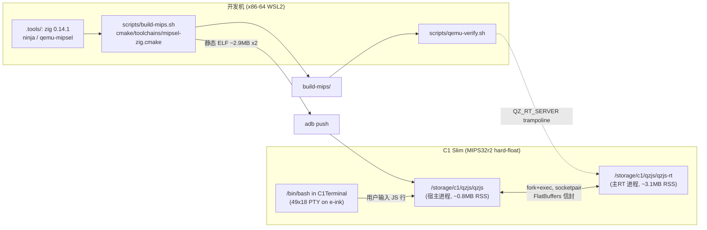

# System architecture

## Overview

- **构建面**：toolchain 文件把编译器固定为 `.tools/bin/zig-cc-mipsel`（内置 `-target mipsel-linux-musleabihf`），链接期 lld 剥离 DWARF。
- **运行面**：qzjs 保持上游 **ISOLATED 进程模型**——宿主 CLI 只泵自己的 `uv_loop` 并经 JSON 消息通道驱动主RT；两二进制同目录即自动解析（`/proc/self/exe`）。
- **交互面**：REPL 是 `fgets(stdin)` 行循环（`qzjs/src/cli.c`），对 PTY 零依赖，天然适配 C1Terminal 与 `adb shell -t`。

## Constraints

- 根分区只读、`/storage` 无 noexec 限制 → 一切落 `/storage/c1/qzjs/`。
- 50 MiB 内存 → 实测峰值 ~4 MB，无压力。
- XBurst 未对齐访问敏感 → minimal 档位（无 WAMR）为默认。
