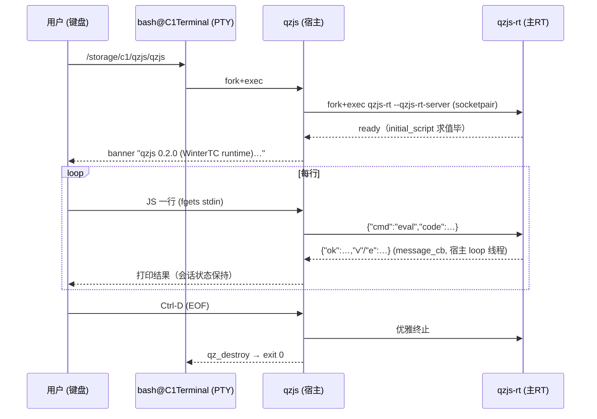

# Key flows

## 一次设备端 REPL 会话

```mermaid
sequenceDiagram
  participant U as 用户 (键盘)
  participant T as bash@C1Terminal (PTY)
  participant H as qzjs (宿主)
  participant R as qzjs-rt (主RT)
  U->>T: /storage/c1/qzjs/qzjs
  T->>H: fork+exec
  H->>R: fork+exec qzjs-rt --qzjs-rt-server (socketpair)
  R-->>H: ready（initial_script 求值毕）
  H-->>U: banner "qzjs 0.2.0 (WinterTC runtime)…"
  loop 每行
    U->>H: JS 一行 (fgets stdin)
    H->>R: {"cmd":"eval","code":…}
    R-->>H: {"ok":…,"v"/"e":…} (message_cb, 宿主 loop 线程)
    H-->>U: 打印结果（会话状态保持）
  end
  U->>H: Ctrl-D (EOF)
  H->>R: 优雅终止
  H-->>T: qz_destroy → exit 0
```

- 求值在 R 内完成：polyfill 懒初始化（`fetch`/`crypto.subtle`/streams 首次访问才装配）。
- 同一 PTY 通路既服务 adb 交互（`adb shell -t`）也服务屏显终端（C1Terminal 内 bash）。
