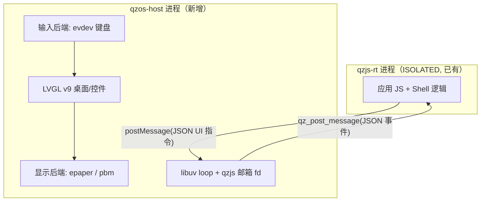

<!-- compiled_truth -->
## 决策：三层结构

OS 分三层，LVGL 与 JS 引擎不在同一进程：

- **宿主持 LVGL + 设备句柄**：`/dev/epaper_lcd` 与 `/dev/input/event0/1` 都在宿主进程；LVGL v9 需要单线程 UI 上下文，正好与宿主泵自己 uv loop 的线程同线程（M-P7 后 qzjs 不再借宿主 loop，见 [[qzos-services-rpc]]）。
- **JS 只说 JSON**：应用不直接调 `lv_*`，而是发 UI 指令（create/set/on/bind 类操作），宿主翻译成 LVGL 调用；控件事件（点击、按键、生命周期）以 JSON 回投到 JS `onmessage`。
- **选 JSON 桥而非 THREAD 直连/同步 RPC 的理由**：沿用 qzjs 现成消息管道（零线程同步）、保留双进程崩溃隔离（应用 JS 崩不掉 UI）、宿主自有 uv loop 单线程无重入；代价是失去 lv_* 原生 API 手感——用一层薄 JS 封装（`ui.label(...)` 风格）补偿。
- **保留 ISOLATED**：不改 qzjs 编译模型，复用已有 qemu 验证与部署路径。

## 显示层四段分工（2026-09-30 重构）

不按进程解耦，按**可测性**解耦——每段都能脱离宿主单测：

| 段 | 职责 | 依赖 |
|---|---|---|
| `raster_1bpp.c` | 1bpp 位运算纯函数（阈值/清屏/画点） | 无 |
| `display_policy.c` | 刷新决策纯逻辑（何时全刷、何时快刷、何时提交） | 无 |
| `panel.c` | 面板描述符 + 设备 I/O（epaper / pbm / none） | `/dev/epaper_lcd` |
| `display.c` | 编排：LVGL flush → 帧 → 决策 → 提交 | LVGL + panel |

- **局部刷新 = 提交决策**：驱动只收整帧，"刷哪块"是策略层的决定，不是设备层的。
- **换 SoC 只改 `panel.c`**：上层不感知任何寄存器/条带差异。
- 入口 env：`QZ_DISPLAY`（epaper/pbm/none）、`QZ_PBM`、`QZ_DUMP_RAW`、`QZ_FULL_EVERY`、`QZ_FAST_THRESHOLD`、`QZ_AUTO_COMMIT`。

## 关键落地事实

- 双向通道：宿主 `qz_post_message` → JS `globalThis.onmessage`；JS `postMessage` → qzjs per-rt 邮箱，宿主经 `qz_message_fd` eventfd 唤醒后 `qz_recv_message` 排干（M-P7：库不再回调宿主 `cfg.message_cb`）。
- 显示帧格式：296x152 1bpp，8 行条带 `offset=(y/8)*296+x, mask=0x80>>(y%8)`，一帧 5624 字节（P4 文件含头 5635）；全刷写 `/sys/devices/platform/e0266a128/epaper/refresh`。
- 输入：evdev `event0`（matrix）+`event1`（gpio），键码表见 C1Terminal `keyboard.go`（Enter=28, 方向=103/105/106/108, Home=102, Back=158, OK=352）。无 evdev 时自动跳过，不阻塞启动。
- 无触摸 → LVGL 用 keypad indev + group 焦点导航，不做 pointer。
- LVGL 用 v9.6.0，显示驱动走自定义 flush 回调，渲染在宿主内存、按需转条带帧。**两个已知陷阱**：`lv_timer_handler` 不自刷新，需显式 invalidate；label 高度需要兜底否则布局塌陷。
- 字体：Fusion Pixel 1bpp 位图，monospaced，`lv_font_conv --bpp 1 --no-compress --autohint-off` 生成 12（默认）/10/8 三档；符号集 `os/fonts/symbols.txt`（4250 字）。拒绝一切矢量/抗锯齿字体。

## 验证通道（没有"编译过=画对了"的余地）

`/dev/epaper_lcd` 是**只写**设备，真机抓不到画面——所以显示正确性靠两条互补的自动化通道守住，视觉本身才需要人眼：

- `scripts/test-display.sh` —— 纯逻辑层单测（133 断言），无 I/O、无全局态、不依赖宿主构建也不依赖设备。**换 SoC 后先跑这个**：条带寻址和刷新节奏的回归在这里挡，比在屏上目视靠谱。
- `scripts/verify-frames.sh` —— 原生 / MIPS 双平台**帧逐字节一致**。显示逻辑全是整数与位运算，两个平台吐出同一帧就是等价性回归的强证据，顺带挡住 MIPS 上的对齐/端序意外。MIPS 侧经 qemu-user 跑，rt 需 trampoline（见 [[qemu-isolated-trampoline]]）。
- `QZ_DISPLAY=pbm` + `scripts/frame-preview.sh` —— 把帧 dump 成 ASCII 供人目检（这是唯一能"看"到画面的方式）。

## 非目标（第一版）

- 不做多窗口/多任务抢占（单全屏应用 + Shell 返回）。
- 不做 JS 直接 `lv_*` 调用（进程内直连）；不改 qzjs 进程模型。
- 不碰厂商签名仓库/c1pkg 信任链（应用以脚本目录形式放 /storage，Shell 自己发现）。

## Timeline

- time: 2026-09-29T21:19:37
  kind: decision
  summary: "Created this page: QZ OS 的 UI 架构：LVGL 宿主 + qzjs ISOLATED 引擎 + JSON UI 桥"
  source: created via brain create-page
  affects: [qzos-ui-architecture]

- time: 2026-09-29T21:20:27
  kind: decision
  summary: Rewrote compiled_truth to the new best understanding
  source: brain update-truth
  affects: [qzos-ui-architecture]

- time: 2026-09-30T00:25:47
  kind: decision
  summary: "UI 字体：Fusion Pixel（像素缝合/位图）monospaced，lv_font_conv --bpp 1 --format lvgl --no-compress --autohint-off 生成 fusion_pixel_12（默认）/10(/8)；符号集 os/fonts/symbols.txt（4250 字：GB2312 一级汉字+ASCII+CJK 标点等，gen_symbols.py 产出）。lv_conf 走 LV_FONT_CUSTOM_INCLUDE 定义 LV_FONT_DEFAULT=&fusion_pixel_12，Montserrat 全关。拒绝一切矢量/抗锯齿字体。"
  affects: [qzos-ui-architecture]

- time: 2026-09-30T00:25:47
  kind: decision
  summary: "系统服务通讯面另立 qzos-services-rpc 页：采用 uvrpc（loop 注入 + IPC/INPROC + FlatBuffers）；本页 JSON 桥仅覆盖 JS 应用 UI，二者并存不互替。"
  affects: [qzos-ui-architecture]

- time: 2026-09-30T02:00:50
  kind: decision
  summary: "e-ink 显示管线落地：lv_timer_handler 不自刷新需显式 invalidate、label 高度兜底陷阱、1bpp 主题样式、qemu 冒烟与目检通道"
  source: "qzos-host 首次端到端验证（原生+MIPS 双平台帧一致）"
  affects: [qzos-ui-architecture]

- time: 2026-09-30T02:19:56
  kind: decision
  summary: "显示分层（不进程解耦）：raster_1bpp 纯函数 / display_policy 纯决策 / panel 描述符+设备 I/O / display 编排；局部刷新=提交决策（驱动只收整帧）；换 SoC 只改 panel.c"
  source: "显示层重构 + 133 断言单测 + 原生/MIPS 双平台验证"
  affects: [qzos-ui-architecture]

- time: 2026-09-30T02:15:45
  kind: decision
  summary: "宿主通讯契约翻正为 M-P7 per-rt 邮箱：库不再回调宿主 cfg.message_cb、不再注入宿主 uv_loop；宿主经 qz_message_fd eventfd 唤醒 + qz_recv_message 排干"
  source: brain update-truth
  affects: [qzos-ui-architecture]

- time: 2026-09-30T02:19:14
  kind: reversal
  summary: "qzjs 更新到上游 85d056a9（M-P7 系列 9 commit）：宿主通讯契约翻正——库不再回调宿主 cfg.message_cb、不再注入宿主 uv_loop；改 per-rt 邮箱 + eventfd，宿主 qz_recv_message 排干。os/src/main.c 删 cfg.uv_loop/cfg.message_cb 注入，on_js_message 改 qz_message_fd uv_poll watcher + drain。bridge/services/input 零改。native 构建+单测133/0+pbm冒烟验证。"
  affects: [qzos-services-rpc]

- time: 2026-09-30T02:55:35
  kind: reversal
  summary: "更正：显示分层的『原生/MIPS 双平台验证』此前不成立——MIPS 构建从未配置成功（fetch-tools.sh 生成了 `zig cxx`，Zig 无此子命令，CMake 在 compiler 检测阶段就退出），所谓双平台验证其实只有原生一跑。现已修复并补上常驻闸门 scripts/verify-frames.sh（133 断言 + 5635 字节帧逐字节相同），后续显示改动以它为准。"
  source: "MIPS 交叉构建打通时的复盘（提交 49c67b9）"
  affects: [zig-musl-cross-build, qzos-ui-architecture]

- time: 2026-09-30T02:56:14
  kind: decision
  summary: Rewrote compiled_truth to the new best understanding
  source: brain update-truth
  affects: [qzos-ui-architecture]

- time: 2026-09-30T03:12:47
  kind: decision
  summary: "键盘通路曾整体失效：lv_init() 会把已注册的 lv_tick_set_cb 回调清成 NULL（实测 lv_tick_get_cb 由非 NULL 变 NULL），本进程无人调 lv_tick_inc，于是 lv_tick_get() 恒 0，lv_timer_handler 认定所有定时器未到期，indev 读取定时器永不触发，evdev 按键堆在队列里静默丢失。之所以长期未被发现：绘制有旁路（bridge 的 refresh op 显式调 lv_refr_now），画面一直是对的，正好盖住坏掉的定时器子系统。教训：**一条链路上部分模块有旁路、另一部分没有时，没被盖住的那部分可能整条是死的而看不出来**——必须有逐跳追踪 + 端到端场景断言。同时修掉 e-ink「无变化就完全不刷」未真正生效（changed==0 仍提交）：改为清空脏区让策略按契约决策，显式全刷请求仍照常生效（清残影是面板的事）。新增 scripts/verify-input.sh + os/test/replay-keys.py：QZ_INPUT0 接 FIFO 按真实 struct input_event 布局回放，场景断言语义（boot/launch/roundtrip，roundtrip 要求逐字节复现桌面帧）而非黄金文件；布局大小随架构不同（x86_64=24 / mips32=16，差在 timeval 的 time_t），--arch 必须显式声明消费者架构。"
  source: "MIPS 构建打通后做输入通路排查（提交 d98d251）"
  affects: [qzos-ui-architecture, zig-musl-cross-build]
