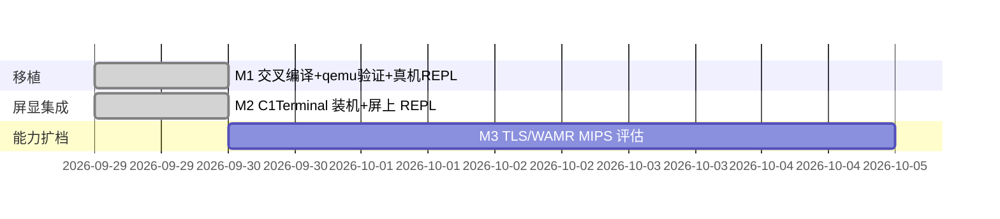

# Roadmap

## 里程碑

- **M1（已完成 2026-09-29）**：Zig 静态交叉编译、`scripts/qemu-verify.sh` 8/8、真机 `/storage/c1/qzjs/` 部署 + PTY REPL（[[port-verification]]）。
- **M2（已完成 2026-09-29，待人工目检）**：Go 1.25.6 构建 C1Terminal（mipsle hardfloat，2.5MB）→ `scripts/c1term-install.sh` 装至 `/usr/data/c1term/`，`qzjs` 符号链接入其 PATH；启停桥针对本机 **C1ancher** 桌面（非 mpenMain）挂起 `/usr/data/c1/core/*` 进程（[[c1-slim-device]]）。墨水屏 `read()` 不可用，画面确认需人工；卡死逃生：`c1term-stop.sh`。
- **M3**：`-DQZ_WITH_TLS=ON`（HTTPS fetch）真机验证；评估 `-DQZ_WITH_WAMR=ON` 在 MIPS/XBurst 上的对齐与性能。
- **远期候选**：把 `qzjs` 做成 C1ancher 桌面一格（需研究其 launcher/应用格式，替代 C1-Slim-Ports 的 mpenMain 桥）；以 qzjs 为引擎的应用运行时层。
