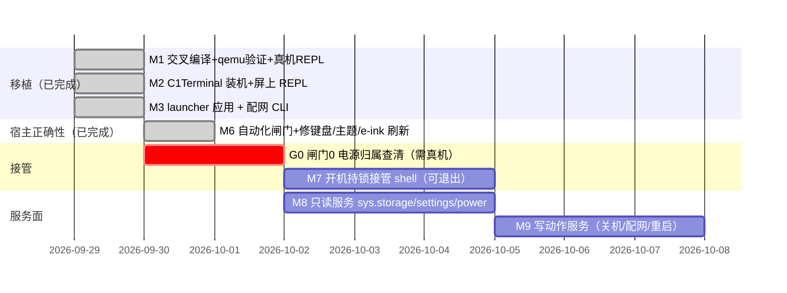

# Roadmap

qzjs 移植（M1–M3）已完成；当前主线是 **qzos 作为系统接管设备**（见 brain
[[qzos-as-system]]）。M4/M5 的内容已被这条主线吸收，不再单列。

- **M1–M3（已完成 2026-09-29）**：Zig 静态交叉编译、8/8 qemu 验证、真机
  `/storage/c1/qzjs/` 部署 + PTY REPL（[[port-verification]]）；C1Terminal 屏上
  REPL；C1ancher 应用化 + `c1wifi` 配网 CLI。
- **M6（已完成 2026-09-30）**：宿主自动化闸门建成（纯逻辑单测 133+82 断言、
  键盘端到端 11 项、原生/MIPS 帧逐字节一致）。过程中修掉一串"编译通过、
  测试全绿、屏上不可用"的真 bug：字母键码映射整段错、方向键真机走不动、
  textarea 光标闪烁每半秒刷屏、默认主题动画每次点击多刷 3~4 次、
  `lv_init()` 清掉 tick 回调导致键盘整条死掉。
  **这一步的价值不只是"测试绿了"，而是把"没有真机也能发现的 bug"清空了**——
  剩下的才是必须上真机才能判断的部分（见闸门 0 与 port-verification 的
  "仍缺的真机验证"）。

## 闸门 0（阻塞 M7/M8/M9，必须先有真机）

**qzos 目前完全没有电源管理**：`keymap.c` 未映射 `KEY_POWER`，宿主与 JS 里没有
任何 suspend / shutdown / reboot 路径。而这台设备熄屏后唯一恢复手段是 USB ADB。
所以「qzos 独占屏幕」必须和「谁负责关机」一起回答，否则会做出**只能拔电的
设备**。

上真机第一件事查清三问：(a) 电源键现在由谁处理（内核 gpio / 厂商守护进程 /
C1ancher？）；(b) 安全的关机与休眠路径；(c) 熄屏后如何回到 qzos。
**这三条落定前不写任何接管代码。**

## 之后的推进顺序

接管（[[qzos-as-system]]）→ 只读服务面 → 写动作服务。每一步都要求效果层面的
自动化断言，而不是"接口能调通"。
