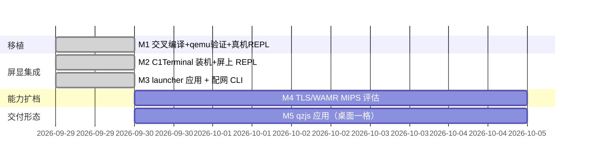

# Roadmap

## 里程碑

- **M1（已完成 2026-09-29）**：Zig 静态交叉编译、`scripts/qemu-verify.sh` 8/8、真机 `/storage/c1/qzjs/` 部署 + PTY REPL（[[port-verification]]）。
- **M2（已完成 2026-09-29，画面待人工目检）**：Go 1.25.6 构建 C1Terminal（mipsle hardfloat，2.5MB）→ `scripts/c1term-install.sh` 装至 `/usr/data/c1term/`，`qzjs` 符号链接入其 PATH。墨水屏 `read()` 不可用，画面确认需人工；卡死逃生：`c1term-stop.sh`。
- **M3（已完成 2026-09-29）**：终端注册成 C1ancher 的应用，桌面应用页选中即开、`HOME` 交还桌面。走的是 c1pkg 契约（目录 0555 信任校验 + `.c1pkg-mode=direct` 的 external-app 锁交接），**不是** SIGSTOP 挂桌面——见 [[c1ancher-app-integration]]。附带 `c1wifi` 配网 CLI：scan / join / forget / off 已实测，成功关联分支待有可用凭据的 AP 再验（[[c1-wifi-stack]]）。
  - 开机自启曾实现并验证过（rootfs 只放 4 行 stub，逻辑留在可写分区，重启后 9s 自动起），按用户决定改为**不默认开启**，只作为 `scripts/c1term-autostart.sh --enable` 的可选形态保留。
- **M4**：`-DQZ_WITH_TLS=ON`（HTTPS fetch）真机验证；评估 `-DQZ_WITH_WAMR=ON` 在 MIPS/XBurst 上的对齐与性能。配网的 `join` 成功分支也挂在这里顺手补验。
- **M5**：把 `qzjs` 本身做成桌面一格（以 `c1pkg` 应用形态承载，入口跑 REPL 或某个具体应用），需要标题时再研究签名仓库的边界。
